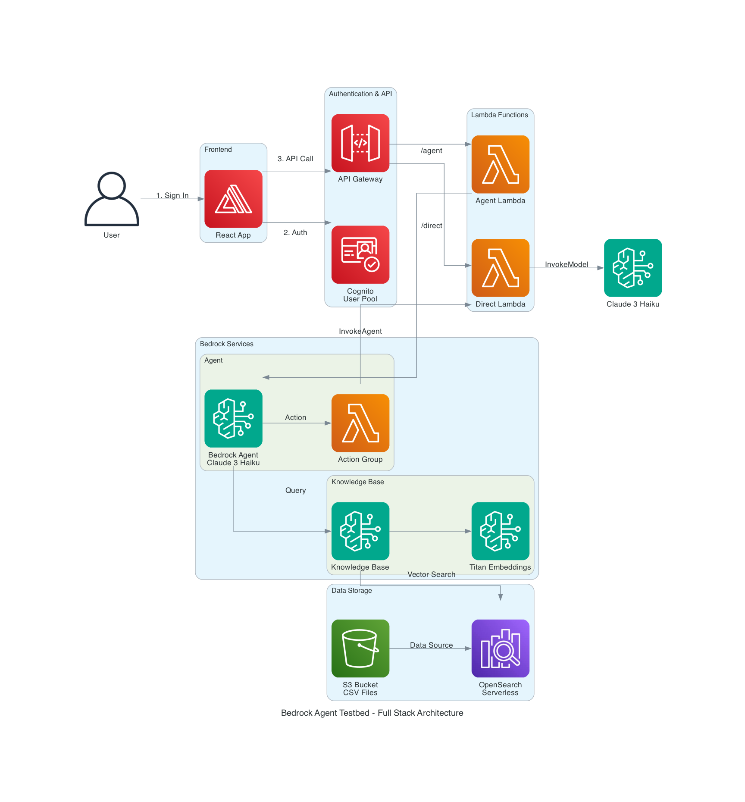

# Bedrock Agent Test Bed

## 📚 Table of Contents

- [Brief Overview](#-brief-overview)
- [Quick Start](#-quick-start)
- [Architecture Overview](#️-architecture-overview)
- [Deployment and Teardown](#-deployment-and-teardown)
- [API Documentation](#-api-documentation)
- [Testing](#-testing)
- [Developer Guide](#-developer-guide)
- [Contributing](#-contributing)
- [License](#-license)
- [Next Steps](#-next-steps)

---

## 📖 Brief Overview

This solution began as a simple, focused, backend test environment for AWS Bedrock that demonstrates how to use Terraform to create a Bedrock agent with a small Knowledge Base to supplement the model with information available about a given city.  Users provide a city name, and Bedrock returns 10 interesting facts by combining:
- **General knowledge** from Claude 3.5 Haiku foundation model
- **Real-world data** from a knowledge base (air quality, water pollution, cost of living, and others)
- **Action groups** that invoke Lambda functions for additional processing

But this has progressed into a full stack AWS-based solution for working with Bedrock.  As more ideas come about and as time permits, additional features will be added. See [Next Steps](#-next-steps) for possible enhancements.

This project showcases two approaches: direct model access and agent-based architecture with knowledge base integration using OpenSearch Serverless vector storage.

**Deployment Modes**:
- **Backend-only**: Lambda + Bedrock + Knowledge Base - test via AWS CLI
- **Full stack** (default): Add API Gateway + Cognito + React frontend - test via browser

### Backend Architecture

The backend architecture includes Lambda, Bedrock, OpenSearch, and S3:


### Full Stack Architecture

The complete architecture includes React frontend with AWS Amplify, Cognito authentication, and API Gateway:



### 🎯 What This Demonstrates

**Input**: City name (e.g., "Geneva", "Tokyo", "Berlin")

**Output**: 10 key facts about the city including:
- Historical significance and founding
- Cultural landmarks and traditions
- Environmental data (air quality, water pollution) from knowledge base
- Economic information (cost of living) from knowledge base
- Population, geography, and interesting trivia

**Key AWS Services**:
- AWS Bedrock (Claude 3.5 Haiku model - chosen for cost-effective testing)
- Bedrock Agents with Action Groups
- Bedrock Knowledge Base with vector search
- OpenSearch Serverless for vector storage
- Lambda functions for custom logic
- S3 for knowledge base data storage

**Model Choice**: This project uses **Claude 3.5 Haiku** for its balance of performance and cost-effectiveness during development and testing. The architecture supports swapping to other Bedrock models (Claude Sonnet, Opus, or other foundation models) as needed.

### 💡 Vector Storage Note

This project uses **OpenSearch Serverless** for vector storage because it's simple to set up and fully managed. However, it is extremely **expensive**, so an S3 Vector store will be added soon as the default:
- **Dev/Test** (1 OCU, no redundancy): ~$175/month
- **Production** (2 OCUs with redundancy): ~$350/month minimum
- **Production** (4 OCUs with redundancy): ~$700/month

**For Bedrock RAG systems, consider these Bedrock-supported alternatives:**

**AWS Native Options:**
- **Amazon Aurora PostgreSQL with pgvector** - Cost-effective, familiar SQL interface, fully supported
- **Amazon Neptune Analytics** - Graph database with vector search capabilities
- **Amazon S3 Vectors** - S3 support to store and query vectors

**Third-Party Options (Bedrock-Supported):**
- **Pinecone** - Purpose-built vector database, pay-per-use pricing
- **MongoDB Atlas** - Document database with vector search
- **Redis Enterprise** - In-memory database with vector capabilities

---

## 🚀 Quick Start

If you're anxious to get started and you're up to speed on npm, Git, Python, Terraform, and AWS CLI and setting its credentials, then follow these steps for a complete deployment in about 10 minutes.

**[📄 Quick Start Guide →](docs/DEPLOYMENT.md)**

The Quick Start guide includes:
- Prerequisites checklist
- One-command deployment
- Testing instructions
- Teardown commands

---

## 🏗️ Architecture Overview

This project currently only demonstrates two examples showing very simplistic ways to call Bedrock, which can be tested either using the UI or via direct Lambda calls.  The demo use case generates 10 key facts about a given city:

### Approach 1: Direct Model Access
```
┌─────────────────┐
│   User Input    │
│ {"city":"Tokyo"}│
└─────────┬───────┘
          │
          ▼
┌─────────────────────────────────────────────────────────┐
│         Lambda Direct (lambda_direct)                   │
│  • Receives city name                                   │
│  • Constructs prompt                                    │
│  • Calls bedrock-runtime.invoke_model()                 │
└─────────┬───────────────────────────────────────────────┘
          │
          ▼
┌─────────────────────────────────────────────────────────┐
│         Claude 3.5 Haiku Foundation Model               │
│  • Processes prompt                                     │
│  • Generates 10 city facts using large language model   │
└─────────┬───────────────────────────────────────────────┘
          │
          ▼
┌─────────────────┐
│   Response      │
│ • 10 facts      │
│ • General info  │
└─────────────────┘
```

### Approach 2: Agent-Based with Knowledge Base
```
┌─────────────────┐
│   User Input    │
│{"city":"Geneva"}│
└─────────┬───────┘
          │
          ▼
┌─────────────────────────────────────────────────────────┐
│         Lambda Agent (lambda_agent)                     │
│  • Receives city name                                   │
│  • Constructs detailed prompt                           │
│  • Calls bedrock-agent-runtime.invoke_agent()           │
└─────────┬───────────────────────────────────────────────┘
          │
          ▼
┌─────────────────────────────────────────────────────────┐
│         Bedrock Agent (Claude 3.5 Haiku)                │
│  • Orchestrates multiple data sources                   │
│  • Plans response strategy                              │
│  • Decides which tools to use based on prompt           │
└─────────┬───────────────────┬───────────────────────────┘
          │                   │
          │                   ▼
          │        ┌──────────────────────────────────┐
          │        │     Knowledge Base               │
          │        │  (OpenSearch Serverless)         │
          │        │                                  │
          │        │ • Vector search for city data    │
          │        │ • Air quality (500+ cities)      │
          │        │ • Water pollution metrics        │
          │        │ • Cost of living (400+ cities)   │
          │        │ • Associated with agent          │
          │        └──────────┬───────────────────────┘
          │                   │
          │                   ▼
          │        ┌──────────────────┐
          │        │   S3 Bucket      │
          │        │ • CSV datasets   │
          │        │ • Vector indexed │
          │        └──────────────────┘
          │
          ▼
┌─────────────────────────────────────────────────────────┐
│    Action Group: /city-facts API (Internal)             │
│  • Agent calls POST /city-facts internally              │
│  • Defined by OpenAPI spec in agent config              │
│  • Executor: lambda_direct function                     │
│  • NOT called directly by users                         │
└─────────┬───────────────────────────────────────────────┘
          │
          ▼
┌─────────────────────────────────────────────────────────┐
│         Lambda Direct (as Action Group)                 │
│  • Invoked by agent via action group                    │
│  • Gets general city facts from model                   │
│  • Returns structured data to agent                     │
└─────────┬───────────────────────────────────────────────┘
          │
          ▼
┌─────────────────────────────────────────────────────────┐
│         Agent Synthesizes Response                      │
│  • Combines knowledge base data                         │
│  • Integrates action group results                      │
│  • Generates coherent narrative                         │
└─────────┬───────────────────────────────────────────────┘
          │
          ▼
┌─────────────────┐
│   Response      │
│ • 10 facts      │
│ • KB data       │
│ • General info  │
└─────────────────┘
```

### How Each Approach Works

**Direct Model Access:**
1. User provides city name → `{"city": "Tokyo"}`
2. Lambda constructs prompt → "Provide 10 facts about Tokyo"
3. Calls Bedrock Runtime → `invoke_model()` with Claude 3.5 Haiku
4. Model generates response → Using large language model
5. Returns 10 facts → General knowledge only

**Agent-Based:**
1. User provides city name → `{"city": "Geneva"}`
2. Lambda constructs prompt → "Tell me about Geneva, including air quality, water pollution, and cost of living"
3. Calls Bedrock Agent → `invoke_agent()` 
4. Agent orchestrates (automatically decides which tools to use):
   - **Knowledge Base Search** → Agent queries OpenSearch for Geneva data (air quality, water pollution, cost of living)
     - Knowledge base is **associated with the agent** via Terraform configuration
     - Agent has IAM permissions to call `bedrock:Retrieve`
   - **Action Group Call** → Agent internally calls `POST /city-facts` API
     - This API is defined in the agent's OpenAPI specification
     - The API is **not called directly by users** - only by the agent
     - Executor is `lambda_direct` function
     - Returns general city facts from the model
5. Agent synthesizes → Combines knowledge base data + action group results
6. Returns comprehensive response → KB data + general facts

### Key Differences

| Feature | Direct Model Access | Agent-Based |
|---------|-------------------|-------------|
| **Lambda Function** | `lambda_direct` | `lambda_agent` |
| **Bedrock API** | `invoke_model()` | `invoke_agent()` |
| **Data Sources** | Large language model only | Model + Knowledge Base + Action Groups |
| **Complexity** | Simple, single API call | Orchestrated, multi-source |
| **Knowledge Base** | ❌ No | ✅ Yes (OpenSearch, associated with agent) |
| **Action Groups** | ❌ No | ✅ Yes (`/city-facts` API, internal only) |
| **Real-time Data** | ❌ No | ✅ Yes (from CSV datasets) |
| **Use Case** | Baseline testing | Full Bedrock capabilities |
| **API Invocation** | Direct Lambda call | Agent orchestrates internal APIs |

**Key Insight**: The `/city-facts` API is an **internal tool** for the agent. Users never call it directly - they call `lambda_agent`, which invokes the Bedrock Agent, which then decides to use the `/city-facts` action group as one of its tools.


## 🚀 Deployment and Teardown

For complete deployment instructions, teardown options, and step-by-step guides, see:

**[📄 Deployment and Teardown Guide](docs/DEPLOYMENT.md)**

The deployment guide includes:
- **Simplified Deployment** - One-command deployment (recommended)
- **Resource Prefixing** - Multi-developer environment support
- **Manual Deployment** - Step-by-step instructions for advanced users
- **Complete Teardown** - One-command destroy to remove all resources and avoid charges (recommended)
- **Partial Teardown** - Infrastructure-only or S3-only cleanup options
- **Cost Information** - Detailed cost implications and redeployment instructions

## 📖 API Documentation

For comprehensive API documentation including OpenAPI specifications, request/response examples, and integration patterns, see:

**[📄 docs/API.md](docs/API.md)**

The API documentation includes:
- **OpenAPI 3.0 Specification** for the City Facts Action Group API
- **Request/Response Examples** for both Lambda functions
- **Error Handling** patterns and common error codes
- **Integration Examples** in Python and Node.js
- **Usage Patterns** for different testing scenarios
- **Rate Limits and Best Practices**

## 🧪 Testing

### 🚀 Quick Testing with Scripts

The testing scripts automatically detect your resource prefix and use the correct function names:

```bash
# Test both direct and agent-based approaches with cities that have complete data
./test-lambda.sh both Geneva

# Test specific functions with knowledge base cities
./test-lambda.sh direct Berlin
./test-lambda.sh agent Zurich

# Use development workflow helper with recommended cities
./scripts/dev-workflow.sh test Basel
```

### 🎯 Automatic Prefix Detection

All scripts automatically detect your prefix from `terraform.tfvars`:

```bash
# If terraform.tfvars contains: resource_prefix = "dts"
./test-lambda.sh both Geneva
# → Tests: dts-bedrock-agent-testbed-city-facts-direct
# → Tests: dts-bedrock-agent-testbed-city-facts-agent

# Without prefix
./test-lambda.sh both Geneva  
# → Tests: bedrock-agent-testbed-city-facts-direct
# → Tests: bedrock-agent-testbed-city-facts-agent
```

### 🧪 Manual Testing with AWS CLI

#### Test Direct Model Access
```bash
aws lambda invoke \
  --function-name bedrock-agent-testbed-city-facts-direct \
  --cli-binary-format raw-in-base64-out \
  --payload '{"city": "Berlin"}' \
  response_direct.json
```

#### Test Agent with Knowledge Base
```bash
aws lambda invoke \
  --function-name bedrock-agent-testbed-city-facts-agent \
  --cli-binary-format raw-in-base64-out \
  --payload '{"city": "Geneva"}' \
  response_agent.json
```

### 🌍 Recommended Test Cities

The knowledge base contains two datasets with extensive city coverage:

**🌟 Cities with Complete Data (Both Datasets):**
These cities have both air quality/water pollution AND cost of living data, providing the richest agent responses:

- **Geneva, Switzerland** - High cost of living, excellent air quality
- **Zurich, Switzerland** - Premium living costs, clean environment  
- **Basel, Switzerland** - Swiss quality with complete datasets
- **Berlin, Germany** - European capital with moderate costs
- **London, United Kingdom** - Global financial center
- **Paris, France** - Cultural capital with urban challenges
- **Boston, USA** - American tech hub with good data
- **Chicago, USA** - Major US city with comprehensive info
- **Los Angeles, USA** - West Coast metropolis
- **Montreal, Canada** - Bilingual city with full datasets

**🌍 Additional Cities with Complete Data:**
Athens, Bangkok, Barcelona, Beijing, Bern, Brussels, Buenos Aires, Delhi, Dubai, Dublin, Helsinki, Lisbon, Madrid, Milan, Miami, Moscow, Mumbai, Oslo

**📊 Dataset Coverage:**
- **Air Quality & Water Pollution**: 500+ cities worldwide (2021 data)
- **Cost of Living**: 400+ cities worldwide (2018 data)  
- **Both Datasets**: 200+ cities with complete information

**🧪 Testing Examples:**
```bash
# Cities with rich knowledge base data
./test-lambda.sh agent "Geneva"
./test-lambda.sh agent "Berlin" 
./test-lambda.sh agent "Tokyo"

# Compare different data availability
./test-lambda.sh both "Geneva"    # Complete data from both sources
./test-lambda.sh both "Singapore" # Partial data, general facts
```

**💡 Pro Tip:** Cities with data in both datasets will provide more comprehensive responses as the agent can combine air quality, water pollution, and cost of living information with general city facts.

## 📚 Developer Guide

For detailed information about components, data sources, development workflows, project structure, troubleshooting, and more, see:

**[📄 Developer Guide](docs/DEVELOPER_GUIDE.md)**

The Developer Guide includes:
- **Project Structure** - Complete file and folder organization
- **Current Components** - Lambda functions, Bedrock agents, and infrastructure details
- **Knowledge Base Data Sources** - Dataset information and coverage
- **Development Workflow** - Day-to-day development operations and scripts
- **Example Responses** - Sample outputs from both Lambda functions
- **Troubleshooting** - Common issues and solutions
- **Quick Reference** - Command cheat sheet for all operations

## 🤝 Contributing

We welcome contributions! Please see [CONTRIBUTING.md](CONTRIBUTING.md) for guidelines on how to contribute to this project.

## 📄 License

This project is licensed under the MIT License - see the [LICENSE](LICENSE) file for details.

## 🔮 Next Steps

### Infrastructure & Deployment
- [ ] **Replace hard-coded values with config-driven settings** - Move hard-coded values (model IDs, regions, city lists, etc.) to centralized configuration files for easier customization and maintenance
- [ ] **Add S3 vector store support** - Implement Amazon S3 as an alternative vector store option (currently OpenSearch Serverless only)
- [ ] **Add CDK deployment option** - Provide AWS CDK as an alternative to Terraform for infrastructure deployment
- [ ] **Implement automated testing pipeline** - Set up CI/CD with GitHub Actions or AWS CodePipeline for automated testing and deployment
- [ ] **Address code coverage** - Add comprehensive test coverage for Terraform configurations and React components

### Bedrock & AI Features
- [ ] **Add model selection capability** - Enable swapping between different Bedrock foundation models (Claude Sonnet, Opus, Llama, etc.) via configuration
- [ ] **Implement Bedrock Guardrails** - Add content filtering, PII detection, and safety policies to protect against inappropriate content
- [ ] **Add more data sources** - Expand knowledge base with additional datasets (weather, demographics, tourism, real-time APIs)
- [ ] **Multi-agent architecture** - Create specialized agents for different domains (environmental data, cultural facts, travel recommendations)
- [ ] **Conversation memory** - Implement session-based memory for contextual conversations
- [ ] **Streaming responses** - Add real-time streaming for agent responses in the UI

### Frontend & User Experience
- [ ] **Deploy frontend to AWS** - Implement production deployment options for React frontend (ECS, App Runner, Amplify Hosting, CloudFront + S3, etc)
- [ ] **Add Streamlit testing interface** - Create a lightweight Streamlit app for quick API Gateway testing and debugging
- [ ] **Wire multiple agents to frontend** - Create UI to select and interact with different specialized agents
- [ ] **Add chatbot interface** - Replace single-query UI with conversation history and multi-turn dialogue

### Backend Testing & Development
- [ ] **Create Jupyter notebook** - Build interactive notebook for Lambda development, Bedrock API exploration, and knowledge base testing
- [ ] **Add Postman collection** - Create comprehensive Postman collection with pre-configured API Gateway endpoints, authentication, and example requests

### Monitoring & Operations
- [ ] **Create production readiness guidelines** - Develop comprehensive guide covering stress testing, resiliency patterns, disaster recovery, monitoring, security hardening, and operational best practices
- [ ] **Add monitoring and alerting** - Set up CloudWatch dashboards, alarms, and X-Ray tracing
- [ ] **Cost optimization** - Implement request caching, optimize OpenSearch usage, add budget alerts
- [ ] **Performance testing** - Load testing and optimization for production workloads
