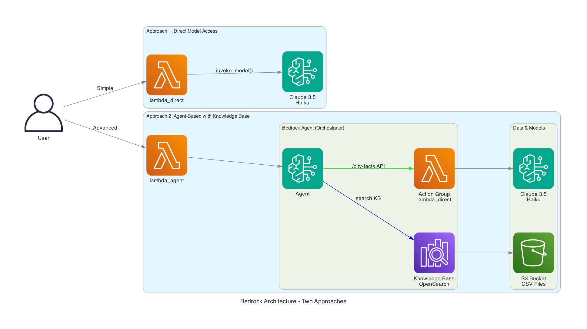

# Bedrock Agent Test Bed with Knowledge Base

A simple, focused test environment for AWS Bedrock that demonstrates how to create a Bedrock agent with a small knowledgebase to supplement the model with information available about a given city.  Users provide a city name, and Bedrock returns 10 interesting facts by combining:
- **General knowledge** from Claude 3.5 Haiku foundation model
- **Real-world data** from a knowledge base (air quality, water pollution, cost of living)
- **Action groups** that invoke Lambda functions for additional processing

This project showcases two approaches: direct model access and agent-based architecture with knowledge base integration using OpenSearch Serverless vector storage.

**Testing**: This is a backend-focused project. Testing is currently done by directly invoking Lambda functions via AWS CLI. No front-end interface exists at this time.

## 🎯 What This Demonstrates

**Input**: City name (e.g., "Geneva", "Tokyo", "Berlin")

**Output**: 10 key facts about the city including:
- Historical significance and founding
- Cultural landmarks and traditions
- Environmental data (air quality, water pollution) from knowledge base
- Economic information (cost of living) from knowledge base
- Population, geography, and interesting trivia

**Key AWS Services Tested**:
- AWS Bedrock (Claude 3.5 Haiku model)
- Bedrock Agents with Action Groups
- Bedrock Knowledge Base with vector search
- OpenSearch Serverless for vector storage
- Lambda functions for custom logic
- S3 for knowledge base data storage

## 📚 Table of Contents

- [Prerequisites and Requirements](#-prerequisites-and-requirements)
- [Architecture Overview](#️-architecture-overview)
- [AWS Access and Permissions](#-aws-access-and-permissions-requirements)
- [Configuration](#️-configuration)
- [Quick Start Deployment](#-quick-start-deployment)
- [Testing](#-testing)
- [API Documentation](#-api-documentation)
- [Development Workflow](#️-development-workflow)
- [Teardown and Cleanup](#-teardown-and-cleanup)
- [Project Structure](#-project-structure)
- [Troubleshooting](#-troubleshooting)

> **⚠️ IMPORTANT: Terraform State Management**
> 
> This project uses Terraform to manage AWS infrastructure. The `terraform.tfstate` file is **CRITICAL** - it maps your configuration to actual AWS resources. 
> 
> - **Never delete** `terraform.tfstate` 
> - **Back it up** regularly
> - **Don't commit it** to version control (contains sensitive data)
> - If lost, use `./import-existing-resources.sh` to recover

## 🏗️ Architecture Overview

This project demonstrates **two distinct approaches** to using AWS Bedrock for generating city information:



### Approach 1: Direct Model Access (Simple)
```
┌─────────────────┐
│   User Input    │
│ {"city":"Tokyo"}│
└─────────┬───────┘
          │
          ▼
┌─────────────────────────────────────────────────────────┐
│         Lambda Direct (lambda_direct)                   │
│  • Receives city name                                   │
│  • Constructs prompt                                    │
│  • Calls bedrock-runtime.invoke_model()                 │
└─────────┬───────────────────────────────────────────────┘
          │
          ▼
┌─────────────────────────────────────────────────────────┐
│         Claude 3.5 Haiku Foundation Model               │
│  • Processes prompt                                     │
│  • Generates 10 city facts using large language model   │
└─────────┬───────────────────────────────────────────────┘
          │
          ▼
┌─────────────────┐
│   Response      │
│ • 10 facts      │
│ • General info  │
└─────────────────┘
```

### Approach 2: Agent-Based with Knowledge Base (Advanced)
```
┌─────────────────┐
│   User Input    │
│{"city":"Geneva"}│
└─────────┬───────┘
          │
          ▼
┌─────────────────────────────────────────────────────────┐
│         Lambda Agent (lambda_agent)                     │
│  • Receives city name                                   │
│  • Constructs detailed prompt                           │
│  • Calls bedrock-agent-runtime.invoke_agent()           │
└─────────┬───────────────────────────────────────────────┘
          │
          ▼
┌─────────────────────────────────────────────────────────┐
│         Bedrock Agent (Claude 3.5 Haiku)                │
│  • Orchestrates multiple data sources                   │
│  • Plans response strategy                              │
│  • Decides which tools to use based on prompt           │
└─────────┬───────────────────┬───────────────────────────┘
          │                   │
          │                   ▼
          │        ┌──────────────────────────────────┐
          │        │     Knowledge Base               │
          │        │  (OpenSearch Serverless)         │
          │        │                                  │
          │        │ • Vector search for city data    │
          │        │ • Air quality (500+ cities)      │
          │        │ • Water pollution metrics        │
          │        │ • Cost of living (400+ cities)   │
          │        │ • Associated with agent          │
          │        └──────────┬───────────────────────┘
          │                   │
          │                   ▼
          │        ┌──────────────────┐
          │        │   S3 Bucket      │
          │        │ • CSV datasets   │
          │        │ • Vector indexed │
          │        └──────────────────┘
          │
          ▼
┌─────────────────────────────────────────────────────────┐
│    Action Group: /city-facts API (Internal)             │
│  • Agent calls POST /city-facts internally              │
│  • Defined by OpenAPI spec in agent config              │
│  • Executor: lambda_direct function                     │
│  • NOT called directly by users                         │
└─────────┬───────────────────────────────────────────────┘
          │
          ▼
┌─────────────────────────────────────────────────────────┐
│         Lambda Direct (as Action Group)                 │
│  • Invoked by agent via action group                    │
│  • Gets general city facts from model                   │
│  • Returns structured data to agent                     │
└─────────┬───────────────────────────────────────────────┘
          │
          ▼
┌─────────────────────────────────────────────────────────┐
│         Agent Synthesizes Response                      │
│  • Combines knowledge base data                         │
│  • Integrates action group results                      │
│  • Generates coherent narrative                         │
└─────────┬───────────────────────────────────────────────┘
          │
          ▼
┌─────────────────┐
│   Response      │
│ • 10 facts      │
│ • KB data       │
│ • General info  │
└─────────────────┘
```

### Key Differences

| Feature | Direct Model Access | Agent-Based |
|---------|-------------------|-------------|
| **Lambda Function** | `lambda_direct` | `lambda_agent` |
| **Bedrock API** | `invoke_model()` | `invoke_agent()` |
| **Data Sources** | Large language model only | Model + Knowledge Base + Action Groups |
| **Complexity** | Simple, single API call | Orchestrated, multi-source |
| **Knowledge Base** | ❌ No | ✅ Yes (OpenSearch, associated with agent) |
| **Action Groups** | ❌ No | ✅ Yes (`/city-facts` API, internal only) |
| **Real-time Data** | ❌ No | ✅ Yes (from CSV datasets) |
| **Use Case** | Baseline testing | Full Bedrock capabilities |
| **API Invocation** | Direct Lambda call | Agent orchestrates internal APIs |

### How Each Approach Works

**Direct Model Access:**
1. User provides city name → `{"city": "Tokyo"}`
2. Lambda constructs prompt → "Provide 10 facts about Tokyo"
3. Calls Bedrock Runtime → `invoke_model()` with Claude 3.5 Haiku
4. Model generates response → Using large language model
5. Returns 10 facts → General knowledge only

**Agent-Based:**
1. User provides city name → `{"city": "Geneva"}`
2. Lambda constructs prompt → "Tell me about Geneva, including air quality, water pollution, and cost of living"
3. Calls Bedrock Agent → `invoke_agent()` 
4. Agent orchestrates (automatically decides which tools to use):
   - **Knowledge Base Search** → Agent queries OpenSearch for Geneva data (air quality, water pollution, cost of living)
     - Knowledge base is **associated with the agent** via Terraform configuration
     - Agent has IAM permissions to call `bedrock:Retrieve`
   - **Action Group Call** → Agent internally calls `POST /city-facts` API
     - This API is defined in the agent's OpenAPI specification
     - The API is **not called directly by users** - only by the agent
     - Executor is `lambda_direct` function
     - Returns general city facts from the model
5. Agent synthesizes → Combines knowledge base data + action group results
6. Returns comprehensive response → KB data + general facts

**Key Insight**: The `/city-facts` API is an **internal tool** for the agent. Users never call it directly - they call `lambda_agent`, which invokes the Bedrock Agent, which then decides to use the `/city-facts` action group as one of its tools.

## 📋 Prerequisites and Requirements

Before deploying this project, ensure you have the following tools installed and configured:

### 🛠️ Required Tools

#### 1. **Terraform** (>= 1.0)
Infrastructure as Code tool for managing AWS resources.

**Installation:**
```bash
# macOS (using Homebrew)
brew install terraform

# Windows (using Chocolatey)
choco install terraform

# Linux (Ubuntu/Debian)
wget -O- https://apt.releases.hashicorp.com/gpg | sudo gpg --dearmor -o /usr/share/keyrings/hashicorp-archive-keyring.gpg
echo "deb [signed-by=/usr/share/keyrings/hashicorp-archive-keyring.gpg] https://apt.releases.hashicorp.com $(lsb_release -cs) main" | sudo tee /etc/apt/sources.list.d/hashicorp.list
sudo apt update && sudo apt install terraform

# Verify installation
terraform --version
```

**Alternative:** Download from [terraform.io](https://www.terraform.io/downloads)

#### 2. **AWS CLI** (>= 2.0)
Command-line interface for interacting with AWS services.

**Installation:**
```bash
# macOS (using Homebrew)
brew install awscli

# Windows (using installer)
# Download from: https://awscli.amazonaws.com/AWSCLIV2.msi

# Linux (using pip)
pip install awscli

# Linux (using package manager)
sudo apt install awscli  # Ubuntu/Debian
sudo yum install awscli  # CentOS/RHEL

# Verify installation
aws --version
```

**Alternative:** Download from [AWS CLI Installation Guide](https://docs.aws.amazon.com/cli/latest/userguide/getting-started-install.html)

#### 3. **Git**
Version control system for cloning the repository.

**Installation:**
```bash
# macOS (using Homebrew)
brew install git

# Windows
# Download from: https://git-scm.com/download/win

# Linux
sudo apt install git      # Ubuntu/Debian
sudo yum install git      # CentOS/RHEL

# Verify installation
git --version
```

### 🔧 Optional Tools (Recommended)

#### **jq** - JSON processor for testing
```bash
# macOS
brew install jq

# Linux
sudo apt install jq      # Ubuntu/Debian
sudo yum install jq      # CentOS/RHEL

# Windows
# Download from: https://stedolan.github.io/jq/download/
```

#### **curl** - For API testing (usually pre-installed)
```bash
# Verify installation
curl --version
```

### 📝 Development Notes

**Python**: The Lambda functions use Python 3.11, but this runs in the AWS Lambda runtime. You don't need Python installed locally unless you plan to modify the Lambda source code.

**System Tools**: The setup scripts use common system tools (`unzip`, `wget`, `curl`) that are typically pre-installed on most systems.

### ✅ Verification Checklist

Run these commands to verify all prerequisites are installed:

```bash
# Check Terraform
terraform --version
# Expected: Terraform v1.0+ 

# Check AWS CLI
aws --version
# Expected: aws-cli/2.0+

# Check Git
git --version
# Expected: git version 2.0+

# Check AWS credentials (after configuration)
aws sts get-caller-identity
# Expected: JSON with your AWS account info

# Optional: Check jq
jq --version
# Expected: jq-1.6+
```

### 🚨 Common Installation Issues

**Terraform not found:**
- Ensure Terraform binary is in your system PATH
- Try restarting your terminal after installation

**AWS CLI not configured:**
- Run `aws configure` to set up credentials
- Ensure you have appropriate AWS permissions (see next section)

**Permission denied errors:**
- On macOS/Linux, you may need to use `sudo` for system-wide installation
- Consider using package managers (Homebrew, apt, yum) instead of manual installation

### 🎯 Quick Setup Script

For macOS users with Homebrew:
```bash
# Install all prerequisites at once
brew install terraform awscli git jq

# Verify installations
terraform --version && aws --version && git --version && jq --version
```

For Ubuntu/Debian users:
```bash
# Update package list
sudo apt update

# Install prerequisites
sudo apt install -y git curl jq

# Install AWS CLI
curl "https://awscli.amazonaws.com/awscli-exe-linux-x86_64.zip" -o "awscliv2.zip"
unzip awscliv2.zip
sudo ./aws/install

# Install Terraform
wget -O- https://apt.releases.hashicorp.com/gpg | sudo gpg --dearmor -o /usr/share/keyrings/hashicorp-archive-keyring.gpg
echo "deb [signed-by=/usr/share/keyrings/hashicorp-archive-keyring.gpg] https://apt.releases.hashicorp.com $(lsb_release -cs) main" | sudo tee /etc/apt/sources.list.d/hashicorp.list
sudo apt update && sudo apt install terraform
```

## 🔐 AWS Access and Permissions Requirements

### AWS CLI Configuration

Before deploying this infrastructure, ensure you have AWS CLI configured with appropriate credentials:

#### Option 1: Default Profile
```bash
# Configure AWS CLI with default profile
aws configure

# Verify your configuration
aws sts get-caller-identity
```

#### Option 2: Named Profile (Recommended)
Using named profiles allows you to manage multiple AWS accounts and switch between them easily:

```bash
# Configure AWS CLI with a named profile
aws configure --profile my-profile

# Set the profile for your current session
export AWS_PROFILE=my-profile

# Verify your configuration
aws sts get-caller-identity
```

#### Alternative Authentication Methods

For different environments, consider these alternatives:
- **AWS SSO**: `aws sso configure`
- **IAM Roles**: Use EC2 instance profiles or assume roles
- **AWS Vault**: Third-party tool for secure credential management

### Required AWS Permissions

This project requires extensive AWS permissions to create and manage multiple services. For the quickest setup, we recommend using admin access for development and testing.

#### 🚀 Simplified Approach: Use Admin Access (Recommended for Development)

For development and testing, the easiest approach is to use an IAM user or role with `AdministratorAccess` policy:

```bash
# Check if you have admin access
aws iam get-user
aws sts get-caller-identity

# Your user should have the AdministratorAccess policy attached
```

**Benefits:**
- ✅ **Quick Setup**: No need to configure individual permissions
- ✅ **Full Access**: Can create all required AWS resources
- ✅ **Easy Testing**: Perfect for development and learning
- ✅ **No Permission Issues**: Eliminates permission-related deployment failures

**When to use:** Development, testing, learning, proof-of-concepts

#### 🔒 Production Approach: Minimal IAM Policy

For production environments, you can use this minimal policy instead of admin access:

```json
{
    "Version": "2012-10-17",
    "Statement": [
        {
            "Effect": "Allow",
            "Action": [
                "iam:CreateRole",
                "iam:DeleteRole",
                "iam:GetRole",
                "iam:PassRole",
                "iam:AttachRolePolicy",
                "iam:DetachRolePolicy",
                "iam:PutRolePolicy",
                "iam:DeleteRolePolicy",
                "iam:GetRolePolicy",
                "iam:ListRolePolicies",
                "iam:ListAttachedRolePolicies",
                "lambda:CreateFunction",
                "lambda:DeleteFunction",
                "lambda:GetFunction",
                "lambda:UpdateFunctionCode",
                "lambda:UpdateFunctionConfiguration",
                "lambda:InvokeFunction",
                "lambda:AddPermission",
                "lambda:RemovePermission",
                "lambda:GetPolicy",
                "logs:CreateLogGroup",
                "logs:DeleteLogGroup",
                "logs:DescribeLogGroups",
                "logs:PutRetentionPolicy",
                "s3:CreateBucket",
                "s3:DeleteBucket",
                "s3:GetBucketLocation",
                "s3:ListBucket",
                "s3:GetObject",
                "s3:PutObject",
                "s3:DeleteObject",
                "s3:GetBucketVersioning",
                "s3:PutBucketVersioning",
                "bedrock:CreateAgent",
                "bedrock:DeleteAgent",
                "bedrock:GetAgent",
                "bedrock:UpdateAgent",
                "bedrock:CreateAgentActionGroup",
                "bedrock:DeleteAgentActionGroup",
                "bedrock:GetAgentActionGroup",
                "bedrock:UpdateAgentActionGroup",
                "bedrock:CreateKnowledgeBase",
                "bedrock:DeleteKnowledgeBase",
                "bedrock:GetKnowledgeBase",
                "bedrock:UpdateKnowledgeBase",
                "bedrock:CreateDataSource",
                "bedrock:DeleteDataSource",
                "bedrock:GetDataSource",
                "bedrock:UpdateDataSource",
                "bedrock:StartIngestionJob",
                "bedrock:GetIngestionJob",
                "bedrock:ListIngestionJobs",
                "bedrock:AssociateAgentKnowledgeBase",
                "bedrock:DisassociateAgentKnowledgeBase",
                "bedrock:InvokeModel",
                "bedrock:Retrieve",
                "aoss:CreateCollection",
                "aoss:DeleteCollection",
                "aoss:UpdateCollection",
                "aoss:BatchGetCollection",
                "aoss:ListCollections",
                "aoss:CreateSecurityPolicy",
                "aoss:DeleteSecurityPolicy",
                "aoss:GetSecurityPolicy",
                "aoss:UpdateSecurityPolicy",
                "aoss:ListSecurityPolicies",
                "aoss:CreateAccessPolicy",
                "aoss:DeleteAccessPolicy",
                "aoss:GetAccessPolicy",
                "aoss:UpdateAccessPolicy",
                "aoss:ListAccessPolicies",
                "aoss:APIAccessAll"
            ],
            "Resource": "*"
        }
    ]
}
```

**When to use:** Production environments, security-conscious deployments, compliance requirements

#### 📋 Detailed Permission Breakdown

The following AWS services and permissions are required:

**Core Infrastructure Permissions:**
- **IAM**: Create and manage roles, policies, and policy attachments
- **Lambda**: Create, update, and invoke functions
- **CloudWatch**: Create and manage log groups
- **S3**: Create buckets, upload objects, and manage bucket policies

**Bedrock Permissions:**
- **Bedrock**: Access to foundation models, create agents, knowledge bases, and data sources
- **Bedrock Agent**: Create and manage agents, action groups, and knowledge base associations
- **Bedrock Runtime**: Invoke models and retrieve from knowledge bases

**OpenSearch Serverless Permissions:**
- **OpenSearch Serverless**: Create collections, security policies, and access policies
- **OpenSearch**: Create and manage vector indices

### AWS Region Requirements

This project is configured for **us-east-1** region. Ensure your AWS CLI is configured for this region:

```bash
# Check current region
aws configure get region

# Set region if needed
aws configure set region us-east-1
```

### Bedrock Model Access

Ensure you have access to the required Bedrock models in us-east-1:

1. **Go to AWS Console → Bedrock → Model Access**
2. **Request access** to the following models, if required:
   - `Claude 3 Haiku` (anthropic.claude-3-haiku-20240307-v1:0)
   - `Amazon Titan Text Embeddings` (amazon.titan-embed-text-v1)

3. **Verify access** via CLI:
```bash
# List available models
aws bedrock list-foundation-models --region us-east-1

# Check specific model access
aws bedrock get-foundation-model \
  --model-identifier anthropic.claude-3-haiku-20240307-v1:0 \
  --region us-east-1
```

### Testing Your Access

Before proceeding with deployment, test your permissions:

```bash
# Test basic AWS access
aws sts get-caller-identity

# Test S3 access
aws s3 ls

# Test Lambda access
aws lambda list-functions --region us-east-1

# Test Bedrock access
aws bedrock list-foundation-models --region us-east-1

# Test OpenSearch Serverless access
aws opensearchserverless list-collections --region us-east-1
```

## ⚙️ Configuration

### 🔧 terraform.tfvars Setup (Optional)

The `terraform.tfvars` file is **optional**. Terraform will use sensible defaults if this file doesn't exist:
- No resource prefix (resources named `bedrock-agent-testbed-*`)
- **Knowledge base ENABLED by default** with Terraform-managed S3 bucket
- Region: us-east-1
- OpenSearch access includes current user

To customize your deployment, create a configuration file:

```bash
# Copy the example file
cp terraform.tfvars.example terraform.tfvars

# Edit with your preferences
# terraform.tfvars (git-ignored)
resource_prefix = "dts"                                   # Your 3-char prefix (optional)
enable_knowledge_base = true                              # Enable Terraform-managed S3 & knowledge base (default: true)
include_current_user_in_opensearch_access = true          # Include current user in OpenSearch access (default: true)
```

### 🏷️ Resource Prefix Options

| Prefix | Use Case | Example Resources |
|--------|----------|-------------------|
| `dts` | Developer initials | `dts-bedrock-agent-testbed-city-facts-direct` |
| `dev` | Development environment | `dev-bedrock-agent-testbed-city-facts-direct` |
| `stg` | Staging environment | `stg-bedrock-agent-testbed-city-facts-direct` |
| _(none)_ | Default/production | `bedrock-agent-testbed-city-facts-direct` |

### 📦 Knowledge Base Deployment Options

| Option | Configuration | S3 Management | Use Case |
|--------|---------------|---------------|----------|
| **Terraform-Managed** (Default) | `enable_knowledge_base = true` | Automatic | New deployments (recommended, enabled by default) |
| **External S3** | `knowledge_base_bucket_name = "bucket"` | Manual scripts | Legacy/existing buckets |
| **Core Only** | `enable_knowledge_base = false` | None | Lambda + Agent only (no KB) |

### 🔐 OpenSearch Access Configuration

The project includes a configurable option for OpenSearch Serverless access:

```bash
# terraform.tfvars
include_current_user_in_opensearch_access = true   # Default: true
```

**When to use `true` (default):**
- ✅ **Development**: Allows manual OpenSearch operations
- ✅ **Debugging**: Direct access to vector indices
- ✅ **Testing**: Manual index creation and management

**When to use `false`:**
- 🔒 **Production**: Better security posture
- 🔒 **Shared environments**: Limit access to service roles only

**What it does:**
- Automatically includes your current AWS user/role in OpenSearch access policy
- Uses `data.aws_caller_identity.current.arn` for dynamic user detection
- No hardcoded user ARNs in configuration

## 🚀 Quick Start Deployment

### 🆕 Latest Improvements

**Recent enhancements for better developer experience:**

- **🔐 Dynamic User Access**: Automatically includes current AWS user in OpenSearch access policy
- **🪣 Smart S3 Management**: Automatic bucket emptying during teardown prevents errors
- **⚙️ Environment Variables**: Lambda functions use dynamic configuration instead of hardcoded values
- **🔄 Error-Free Teardown**: Improved teardown process handles versioned buckets and delete markers
- **📋 Better Documentation**: Comprehensive configuration options and troubleshooting guides

### 🎯 New Simplified Deployment (Recommended)

The easiest way to deploy everything, including Terraform-managed S3 and automatic file uploads of sample city data needed for the knowledge base:

```bash
# Clone and navigate to the project
git clone https://github.com/dspenard/lambda-bedrock-kb-test.git && cd lambda-bedrock-kb-test

# Deploy everything with one command (no prefix)
./scripts/deploy-complete.sh

# OR deploy with a 3-character prefix for multi-developer environments
# ./scripts/deploy-complete.sh dts  # Using your initials
# ./scripts/deploy-complete.sh dev  # Using environment name
```

This single command will:
1. ✅ Initialize Terraform
2. ✅ Create all infrastructure (Lambda, IAM, Bedrock Agent)
3. ✅ Create S3 bucket with proper naming
4. ✅ Upload knowledge base CSV files automatically
5. ✅ Create OpenSearch Serverless collection
6. ✅ Create Bedrock knowledge base with data sources
7. ✅ Associate everything together
8. ✅ Provide test commands for immediate use

**Total deployment time**: ~5-10 minutes

### 🏷️ Resource Prefixing for Multi-Developer Environments

This project supports optional 3-character prefixes to avoid resource name collisions:

```bash
# Deploy with developer initials
./scripts/deploy-complete.sh dts   # Creates: dts-bedrock-agent-testbed-*

# Deploy with environment name  
./scripts/deploy-complete.sh dev   # Creates: dev-bedrock-agent-testbed-*

# Deploy without prefix (default)
./scripts/deploy-complete.sh       # Creates: bedrock-agent-testbed-*
```

**Benefits:**
- Multiple developers can deploy to the same AWS account
- Environment isolation (dev, staging, prod)
- Easy resource identification and cost tracking

### Option 2: Legacy Deployment (External S3 Management)

For existing deployments or when you need external S3 bucket management:

For a completely automated deployment, use the provided script:

```bash
# Clone and navigate to the project
git clone https://github.com/dspenard/lambda-bedrock-kb-test.git && cd lambda-bedrock-kb-test

# Run the complete deployment script
./scripts/deploy-complete.sh
```

This script will:
1. Initialize Terraform
2. Deploy core infrastructure
3. Setup S3 bucket and upload data
4. Create OpenSearch collection
5. Create the vector index automatically
6. Deploy the knowledge base
7. Ingest all data sources
8. Test the deployment

### 🔧 Configuration Options

#### Option 1: Terraform-Managed S3 (Default)
Set `enable_knowledge_base = true` in your `terraform.tfvars`:

```hcl
# terraform.tfvars
resource_prefix = "dts"          # Optional 3-char prefix
enable_knowledge_base = true     # Enable Terraform-managed S3
```

#### Option 2: External S3 Bucket
Use the legacy setup script and reference existing bucket:

```bash
./setup-knowledge-base-s3.sh dts  # Creates external S3 bucket
# terraform.tfvars will be updated automatically
```

### Option 3: Manual Step-by-Step Deployment

For advanced users who want full control over each step:

### Prerequisites
- AWS CLI configured with appropriate permissions
- Terraform installed
- `jq` for JSON processing (optional, for testing)

### ⚠️ Important: Terraform State Management

**CRITICAL**: The `terraform.tfstate` file contains the mapping between your Terraform configuration and your actual AWS resources. **Never delete or lose this file!**

- ✅ **Keep it safe**: Back up your `terraform.tfstate` file regularly
- ✅ **Don't commit it**: The `.gitignore` file excludes it from version control (contains sensitive data)
- ✅ **Team usage**: For team environments, consider using [Terraform remote state](https://developer.hashicorp.com/terraform/language/settings/backends)
- ❌ **Never delete**: If lost, you'll need to manually import all resources (see `import-existing-resources.sh`)

### Configuration Files

This project uses several configuration files:

1. **`terraform.tfvars`** - Contains your S3 bucket name (created by `setup-knowledge-base-s3.sh`)
   ```hcl
   knowledge_base_bucket_name = "bedrock-kb-xxxxxxxx"
   ```

2. **`.kb-bucket-name`** - Backup reference file with S3 bucket name

3. **`terraform.tfstate`** - **CRITICAL** - Contains your infrastructure state mapping

**Note**: The knowledge base components are conditional - they only deploy when `knowledge_base_bucket_name` is provided in `terraform.tfvars`.

### Step 1: Initial Infrastructure Setup
```bash
# Clone and navigate to the project
git clone https://github.com/dspenard/lambda-bedrock-kb-test.git && cd lambda-bedrock-kb-test

# Initialize Terraform
terraform init

# Deploy core infrastructure (Lambda functions, IAM roles, Bedrock agent)
terraform apply
```

### Step 2: Knowledge Base S3 Setup
```bash
# Create S3 bucket and upload knowledge base data
./setup-knowledge-base-s3.sh

# This script will:
# - Create a uniquely named S3 bucket (bedrock-kb-xxxxxxxx)
# - Upload both CSV files to the bucket
# - Create terraform.tfvars with the bucket name
# - Create .kb-bucket-name as a backup reference

# Verify upload
./check-knowledge-base-s3.sh
```

### Step 3: Deploy Knowledge Base Infrastructure
```bash
# Deploy OpenSearch Serverless collection and knowledge base
terraform apply
```

### Step 4: **AUTOMATED** - Create OpenSearch Vector Index

Use the provided script to automate the manual step:

```bash
# Create the vector index automatically
./create-opensearch-index.sh
```

**OR** create it manually:

1. **Get the collection ID** from Terraform output or run:
   ```bash
   aws opensearchserverless list-collections --region us-east-1
   ```

2. **Create the vector index** using AWS CLI:
   ```bash
   # Replace COLLECTION_ID with your actual collection ID
   aws opensearchserverless create-index \
     --id COLLECTION_ID \
     --index-name bedrock-knowledge-base-default-index \
     --index-schema '{
       "settings": {
         "index": {
           "knn": true
         }
       },
       "mappings": {
         "properties": {
           "embeddings": {
             "type": "knn_vector",
             "dimension": 1536,
             "method": {
               "name": "hnsw",
               "space_type": "l2",
               "engine": "faiss"
             }
           },
           "text": {
             "type": "text"
           },
           "bedrock-metadata": {
             "type": "text"
           }
         }
       }
     }' \
     --region us-east-1
   ```

3. **Verify index creation**:
   ```bash
   aws opensearchserverless get-index \
     --id COLLECTION_ID \
     --index-name bedrock-knowledge-base-default-index \
     --region us-east-1
   ```

### Step 5: Complete Knowledge Base Setup
```bash
# Deploy the knowledge base (now that the index exists)
terraform apply

# The knowledge base should now be created successfully
```

### Step 6: Ingest Knowledge Base Data
```bash
# Get knowledge base and data source IDs from Terraform output
KB_ID=$(terraform output -raw knowledge_base_id)
DS1_ID=$(terraform output -raw air_quality_data_source_id)
DS2_ID=$(terraform output -raw cost_of_living_data_source_id)

# Start ingestion for air quality data
aws bedrock-agent start-ingestion-job \
  --knowledge-base-id $KB_ID \
  --data-source-id $DS1_ID \
  --description "Initial ingestion of air quality data" \
  --region us-east-1

# Wait for completion, then start cost of living data ingestion
aws bedrock-agent start-ingestion-job \
  --knowledge-base-id $KB_ID \
  --data-source-id $DS2_ID \
  --description "Initial ingestion of cost of living data" \
  --region us-east-1
```

### Step 7: Test the Complete System
```bash
# Test the agent with knowledge base integration
aws lambda invoke \
  --function-name bedrock-agent-testbed-city-facts-agent \
  --cli-binary-format raw-in-base64-out \
  --payload '{"city": "New York City"}' \
  response.json

# View the response
cat response.json | jq -r '.body' | jq .
```

## 🧪 Testing

### 🚀 Quick Testing with Scripts

The testing scripts automatically detect your resource prefix and use the correct function names:

```bash
# Test both direct and agent-based approaches with cities that have complete data
./test-lambda.sh both Geneva

# Test specific functions with knowledge base cities
./test-lambda.sh direct Berlin
./test-lambda.sh agent "Zurich"

# Use development workflow helper with recommended cities
./scripts/dev-workflow.sh test Basel
```

### 🎯 Automatic Prefix Detection

All scripts automatically detect your prefix from `terraform.tfvars`:

```bash
# If terraform.tfvars contains: resource_prefix = "dts"
./test-lambda.sh both Geneva
# → Tests: dts-bedrock-agent-testbed-city-facts-direct
# → Tests: dts-bedrock-agent-testbed-city-facts-agent

# Without prefix
./test-lambda.sh both Geneva  
# → Tests: bedrock-agent-testbed-city-facts-direct
# → Tests: bedrock-agent-testbed-city-facts-agent
```

## 📖 API Documentation

### Complete API Specification

For comprehensive API documentation including OpenAPI specifications, request/response examples, and integration patterns, see:

**[📄 docs/API.md](docs/API.md)**

The API documentation includes:
- **OpenAPI 3.0 Specification** for the City Facts Action Group API
- **Request/Response Examples** for both Lambda functions
- **Error Handling** patterns and common error codes
- **Integration Examples** in Python and Node.js
- **Usage Patterns** for different testing scenarios
- **Rate Limits and Best Practices**

### Quick API Reference

#### Lambda Direct (Simple Model Access)

**Input**:
```json
{"city": "Tokyo"}
```

**Output**:
```json
{
  "city": "Tokyo",
  "facts": ["fact 1", "fact 2", ...],
  "total_facts": 10,
  "message": "Here are facts about Tokyo generated by Claude 3 Haiku!",
  "model_used": "anthropic.claude-3-haiku-20240307-v1:0"
}
```

#### Lambda Agent (Agent-Based with Knowledge Base)

**Input**:
```json
{"city": "Geneva"}
```

**Output**:
```json
{
  "city": "Geneva",
  "agent_response": "Here is what I can share about Geneva:\n\nBased on the search results, Geneva has an air quality index of 20.17...",
  "message": "City facts for Geneva generated via Bedrock Agent",
  "agent_id": "137GJDIGTS",
  "session_id": "unique-session-id",
  "source": "bedrock_agent"
}
```

### Testing Commands

```bash
# Test direct Lambda
aws lambda invoke \
  --function-name bedrock-agent-testbed-city-facts-direct \
  --cli-binary-format raw-in-base64-out \
  --payload '{"city": "Tokyo"}' \
  response.json

# Test agent Lambda
aws lambda invoke \
  --function-name bedrock-agent-testbed-city-facts-agent \
  --cli-binary-format raw-in-base64-out \
  --payload '{"city": "Geneva"}' \
  response.json
```

## 🔥 Teardown and Cleanup

This project provides multiple teardown options depending on your needs. Choose the appropriate method based on your situation:

### 🎯 Teardown Decision Guide

**Use Complete Teardown when:**
- You're done with the project permanently
- You want to avoid all AWS charges
- You need to clean up everything for a fresh start

**Use Infrastructure-Only Teardown when:**
- You want to pause the project temporarily
- You want to keep your knowledge base data
- You plan to redeploy soon

**Use S3-Only Teardown when:**
- You want to clean up data but keep infrastructure
- You're testing with different datasets
- You want to reduce storage costs only

---

### 1. Complete Teardown (Recommended for final cleanup)

**Command:**
```bash
./teardown-complete.sh
```

**Interactive Process:**
1. **Confirmation**: Script shows all resources to be destroyed
2. **S3 Auto-Empty**: Automatically empties S3 bucket before destruction
3. **Infrastructure**: Destroys all Terraform-managed resources
4. **Legacy S3 Cleanup**: Asks if you want to delete any legacy S3 buckets
5. **Local Files**: Asks if you want to clean up configuration files

**What gets destroyed:**
- ✅ All Lambda functions and IAM roles
- ✅ Bedrock agent and action groups
- ✅ Knowledge base and data sources
- ✅ OpenSearch Serverless collection
- ✅ CloudWatch log groups
- ✅ S3 bucket and data (automatically emptied)
- ✅ Local configuration files (optional)

**🆕 New Features:**
- **Automatic S3 Emptying**: No more "bucket not empty" errors
- **Handles Versioned Buckets**: Deletes all versions and delete markers
- **Dynamic Bucket Detection**: Gets bucket name from Terraform state
- **Error-Free Teardown**: Smooth destruction process

**Estimated time:** 5-10 minutes (OpenSearch deletion is slow)

**Cost impact:** Eliminates all ongoing charges

---

### 2. Infrastructure-Only Teardown

**Command:**
```bash
./teardown-infrastructure.sh
```

**Process:**
1. **Verification**: Checks for terraform.tfstate file
2. **Resource List**: Shows all resources to be destroyed
3. **Confirmation**: Single confirmation prompt
4. **Destruction**: Runs `terraform destroy`

**What gets destroyed:**
- ✅ All Terraform-managed infrastructure
- ❌ S3 bucket and data (preserved)
- ❌ Local configuration files (preserved)

**What's preserved:**
- 📦 S3 bucket with knowledge base data
- 📄 `terraform.tfvars` file
- 📄 `.kb-bucket-name` reference
- 📄 `terraform.tfstate` for reference

**Quick redeploy:** `terraform apply`

**Estimated time:** 5-10 minutes

**Cost impact:** Eliminates compute charges, keeps storage charges

---

### 3. S3-Only Teardown

**Command:**
```bash
./teardown-s3-only.sh
```

**Process:**
1. **Bucket Detection**: Finds S3 bucket from config files
2. **Content Preview**: Shows current bucket contents
3. **Confirmation**: Requires typing 'yes' to confirm
4. **Data Deletion**: Removes all objects from bucket
5. **Bucket Deletion**: Removes the bucket itself
6. **Local Cleanup**: Optionally updates local references

**What gets destroyed:**
- ✅ S3 bucket and all data
- ✅ Local bucket references (optional)
- ❌ All other infrastructure (preserved)

**⚠️ Warning:** Knowledge base data cannot be recovered once deleted

**Estimated time:** 1-2 minutes

**Cost impact:** Eliminates storage charges only

---

### 4. Manual Teardown (Advanced Users)

For granular control or troubleshooting:

```bash
# Step 1: Destroy infrastructure
terraform destroy

# Step 2: Clean up S3 (optional)
BUCKET_NAME=$(cat .kb-bucket-name)
aws s3 rm s3://$BUCKET_NAME --recursive
aws s3 rb s3://$BUCKET_NAME

# Step 3: Clean up local files (optional)
rm -f terraform.tfstate* terraform.tfvars .kb-bucket-name
rm -rf .terraform/
rm -f *.zip test_*.json response*.json
```

---

### 🚨 Important Teardown Considerations

#### Before Teardown
- **Backup State**: Copy `terraform.tfstate` if you might need it later
- **Export Data**: Download any important test results or configurations
- **Check Dependencies**: Ensure no other projects depend on these resources

#### During Teardown
- **Be Patient**: OpenSearch collections take 5-15 minutes to delete
- **Monitor Progress**: Check AWS console if Terraform seems stuck
- **Handle Errors**: Some resources may need manual cleanup if dependencies exist

#### After Teardown
- **Verify Billing**: Check AWS billing console for remaining charges
- **Clean Console**: Manually verify resources are deleted in AWS console
- **Update Documentation**: Note any manual cleanup steps for future reference

#### Recovery Options
- **Lost State**: Use `./import-existing-resources.sh` if state file is accidentally deleted
- **Partial Failure**: Run teardown scripts multiple times - they're idempotent
- **Manual Cleanup**: Use AWS console for stuck resources

---

### 💰 Cost Implications

**Ongoing Charges (when deployed):**
- OpenSearch Serverless: ~$0.24/hour minimum
- Lambda: Pay per invocation (minimal)
- S3: ~$0.023/GB/month
- CloudWatch Logs: ~$0.50/GB ingested

**After Infrastructure Teardown:**
- S3 storage charges only (~$0.023/GB/month)

**After Complete Teardown:**
- No ongoing charges

---

### 🔄 Redeployment After Teardown

**After Infrastructure-Only Teardown:**
```bash
terraform apply  # Uses existing S3 bucket
```

**After Complete Teardown:**
```bash
./scripts/deploy-complete.sh  # Full redeployment needed
```

**After S3-Only Teardown:**
```bash
./setup-knowledge-base-s3.sh  # Recreate S3 bucket
terraform apply                # Update knowledge base
```

### Manual Testing Examples

#### Test Direct Model Access
```bash
aws lambda invoke \
  --function-name bedrock-agent-testbed-city-facts-direct \
  --cli-binary-format raw-in-base64-out \
  --payload '{"city": "Berlin"}' \
  response_direct.json
```

#### Test Agent with Knowledge Base
```bash
aws lambda invoke \
  --function-name bedrock-agent-testbed-city-facts-agent \
  --cli-binary-format raw-in-base64-out \
  --payload '{"city": "Geneva"}' \
  response_agent.json
```

#### Test Cities with Knowledge Base Data

The knowledge base contains two datasets with extensive city coverage:

**🌟 Recommended Test Cities (Complete Data in Both Datasets):**
These cities have both air quality/water pollution AND cost of living data, providing the richest agent responses:

- **Geneva, Switzerland** - High cost of living, excellent air quality
- **Zurich, Switzerland** - Premium living costs, clean environment  
- **Basel, Switzerland** - Swiss quality with complete datasets
- **Berlin, Germany** - European capital with moderate costs
- **London, United Kingdom** - Global financial center
- **Paris, France** - Cultural capital with urban challenges
- **Boston, USA** - American tech hub with good data
- **Chicago, USA** - Major US city with comprehensive info
- **Los Angeles, USA** - West Coast metropolis
- **Montreal, Canada** - Bilingual city with full datasets

**🌍 Additional Cities with Complete Data:**
Athens, Bangkok, Barcelona, Beijing, Bern, Brussels, Buenos Aires, Delhi, Dubai, Dublin, Helsinki, Lisbon, Madrid, Milan, Miami, Moscow, Mumbai, Oslo

**📊 Dataset Coverage:**
- **Air Quality & Water Pollution**: 500+ cities worldwide (2021 data)
- **Cost of Living**: 400+ cities worldwide (2018 data)  
- **Both Datasets**: 200+ cities with complete information

**🧪 Testing Examples:**
```bash
# Cities with rich knowledge base data
./test-lambda.sh agent "Geneva"
./test-lambda.sh agent "Berlin" 
./test-lambda.sh agent "Tokyo"

# Compare different data availability
./test-lambda.sh both "Geneva"    # Complete data from both sources
./test-lambda.sh both "Singapore" # Partial data, general facts
```

**💡 Pro Tip:** Cities with data in both datasets will provide more comprehensive responses as the agent can combine air quality, water pollution, and cost of living information with general city facts.

## 📊 Current Components

### Lambda Functions
- **Direct**: `bedrock-agent-testbed-city-facts-direct` - Direct Claude 3 Haiku access
- **Agent**: `bedrock-agent-testbed-city-facts-agent` - Bedrock agent integration

### Bedrock Agent
- **Agent ID**: Retrieved from Terraform output
- **Model**: Claude 3 Haiku (`anthropic.claude-3-haiku-20240307-v1:0`)
- **Action Groups**: CityFactsActionGroup (invokes direct Lambda)
- **Knowledge Base**: Integrated with OpenSearch Serverless

### Knowledge Base
- **Vector Store**: OpenSearch Serverless
- **Embedding Model**: Amazon Titan Text Embeddings
- **Data Sources**: 
  - World cities air quality and water pollution (2021)
  - World cities cost of living (2018)

## 📊 Knowledge Base Data Sources

This project uses real-world datasets sourced from **[Kaggle](https://www.kaggle.com)** to demonstrate knowledge base functionality:

### Air Quality & Water Pollution Dataset (2021)
- **Coverage**: 500+ cities worldwide
- **Metrics**: Air Quality Index, Water Pollution Index
- **Format**: CSV with city, region, country, and pollution metrics
- **Use Case**: Environmental data for city comparisons

### Cost of Living Dataset (2018)
- **Coverage**: 400+ cities worldwide
- **Metrics**: Cost of Living Index, Rent Index, Groceries Index, Restaurant Price Index
- **Format**: CSV with comprehensive economic indicators
- **Use Case**: Economic data for lifestyle and affordability insights

### Data Processing
- **Purpose**: Educational and demonstration use in this Bedrock Agent test environment
- **Processing**: Data is chunked and vectorized using Amazon Titan embeddings for semantic search
- **Integration**: Accessible via Bedrock Agent through OpenSearch Serverless vector database

## 🛠️ Development Workflow

### 🚀 Simplified Workflow with Terraform-Managed S3

The new approach eliminates most manual steps:

```bash
# Complete deployment (includes S3, files, and knowledge base)
./scripts/deploy-complete.sh dts

# Update Lambda code only (auto-detects prefix)
./scripts/deploy-lambda.sh

# Test functions (auto-detects prefix)  
./test-lambda.sh both Geneva

# Check deployment status (shows all resources with prefix)
./scripts/dev-workflow.sh status

# View logs (auto-detects function names)
./scripts/dev-workflow.sh logs-direct
./scripts/dev-workflow.sh logs-agent
```

### 🔄 Quick Lambda Updates (No Terraform)

For rapid development iterations:
```bash
# Deploy both functions (auto-detects prefix from terraform.tfvars)
./deploy-lambda.sh

# Deploy specific function
./deploy-direct.sh      # Direct model access only
./deploy-agent.sh       # Agent-based only
```

### 📊 Development Helper Commands

```bash
# Show comprehensive status (all resources with your prefix)
./scripts/dev-workflow.sh status

# Test with recommended cities
./scripts/dev-workflow.sh test Geneva
./scripts/dev-workflow.sh test-agent Berlin

# View recent logs
./scripts/dev-workflow.sh logs-direct
./scripts/dev-workflow.sh logs-agent

# Quick Terraform operations
./scripts/dev-workflow.sh terraform
```

### 🗂️ Legacy S3 Management (External Buckets)

For existing deployments using external S3 buckets:
```bash
# Setup S3 bucket and upload data
./scripts/dev-workflow.sh setup-kb-s3

# Check knowledge base status
./scripts/dev-workflow.sh check-kb-s3

# Clean up (if needed)
./scripts/dev-workflow.sh cleanup-kb-s3
```

### Infrastructure Changes
```bash
# For infrastructure changes
terraform plan
terraform apply
```

## 📁 Project Structure

```
.
├── terraform/                        # 🏗️ Infrastructure as Code
│   ├── main.tf                       # Main Terraform configuration with prefix support
│   ├── lambda.tf                     # Lambda functions and IAM (prefix-aware)
│   ├── bedrock_agent.tf              # Bedrock agent configuration (prefix-aware)
│   ├── bedrock_knowledge_base_simple.tf # Knowledge base with Terraform-managed S3
│   ├── outputs.tf                    # Terraform outputs (prefix-aware)
│   ├── terraform.tfvars              # 🔧 Your personal config (git-ignored, prefix settings)
│   ├── terraform.tfvars.example      # 📋 Example configuration file
│   ├── terraform.tfstate             # ⚠️ CRITICAL: Infrastructure state (DO NOT DELETE)
│   └── .terraform/                   # Terraform working directory
├── scripts/                          # 🛠️ Deployment and Management Scripts
│   ├── deploy-complete.sh            # 🚀 Complete automated deployment (NEW)
│   ├── deploy-lambda.sh              # Deploy Lambda functions (prefix-aware)
│   ├── deploy-direct.sh              # Deploy direct model Lambda only
│   ├── deploy-agent.sh               # Deploy agent Lambda only
│   ├── build.sh                      # Build Lambda packages
│   ├── test-lambda.sh                # 🧪 Testing script (prefix-aware)
│   ├── dev-workflow.sh               # 🛠️ Development helper (prefix-aware)
│   ├── teardown-complete.sh          # 🔥 Complete infrastructure teardown
│   ├── teardown-infrastructure.sh    # 🏗️ Infrastructure-only teardown
│   ├── teardown-s3-only.sh           # 🪣 S3 data teardown
│   ├── import-existing-resources.sh  # 🆘 State recovery script (prefix-aware)
│   ├── setup-knowledge-base-s3.sh    # 📦 Legacy S3 setup (external buckets)
│   └── check-knowledge-base-s3.sh    # 🔍 Check S3 status
├── src/                              # 💻 Lambda Source Code
│   ├── lambda_direct/
│   │   └── index.py                  # Direct model access Lambda
│   └── lambda_agent/
│       └── index.py                  # Agent-based Lambda
├── data/                             # 📊 Test Data and Knowledge Base Content
│   ├── lambda-tests/                 # Test payloads
│   │   ├── direct-*.json
│   │   ├── agent-*.json
│   │   └── README.md
│   └── knowledge-base/               # Knowledge base source data
│       ├── world_cities_air_quality_water_pollution_2021.csv
│       ├── world_cities_cost_of_living_2018.csv
│       └── README.md
├── docs/                             # 📖 Documentation
│   ├── API.md                        # Complete API documentation with OpenAPI specs
│   └── bedrock-full-comparison.png   # Architecture diagram
├── .kb-bucket-name                   # 📝 S3 bucket name reference (legacy)
├── *.zip                             # Generated Lambda packages (git-ignored)
├── test_*.json                       # Generated test results (git-ignored)
└── README.md                         # This file
```

### 🔑 Key Files and Folders

**📁 terraform/** - Infrastructure as Code
- All Terraform configuration files
- Your personal `terraform.tfvars` settings (optional - has defaults)
- **CRITICAL**: `terraform.tfstate` file (never delete!)

**📁 scripts/** - Automation and Management
- All deployment, testing, and teardown scripts
- Auto-detect resource prefixes from terraform.tfvars
- Run from project root: `./scripts/deploy-complete.sh`

**📁 src/** - Lambda Source Code
- Organized by function type
- `lambda_direct/` - Direct model access
- `lambda_agent/` - Agent-based approach

**📁 data/** - Test Data and Knowledge Base
- `lambda-tests/` - JSON payloads for testing
- `knowledge-base/` - CSV files for vector database

**📁 docs/** - Documentation
- `API.md` - Complete API documentation with OpenAPI specifications
- `bedrock-full-comparison.png` - Architecture diagram

### 🚀 Quick Start Commands

```bash
# Complete deployment (from project root)
./scripts/deploy-complete.sh dts

# Update Lambda code only
./scripts/deploy-lambda.sh

# Test functions
./scripts/test-lambda.sh both Geneva

# Development workflow helper
./scripts/dev-workflow.sh status

# Terraform operations
cd terraform && terraform plan && cd ..

# Complete teardown
./scripts/teardown-complete.sh
```

## 🔧 Troubleshooting

### Common Issues

#### 1. OpenSearch Vector Index Creation (New Deployment Process)
**Problem**: Knowledge base creation fails with "no such index [bedrock-knowledge-base-default-index]"
**Solution**: The deployment process now handles this automatically, but if you encounter issues:

```bash
# Get collection ID from Terraform output
COLLECTION_ID=$(terraform output -raw opensearch_collection_id)

# Create the vector index manually
aws opensearchserverless create-index \
  --id "$COLLECTION_ID" \
  --index-name "bedrock-knowledge-base-default-index" \
  --index-schema '{
    "settings": {"index": {"knn": true}},
    "mappings": {
      "properties": {
        "embeddings": {
          "type": "knn_vector",
          "dimension": 1536,
          "method": {"name": "hnsw", "space_type": "l2", "engine": "faiss"}
        },
        "text": {"type": "text"},
        "bedrock-metadata": {"type": "text"}
      }
    }
  }' \
  --region us-east-1
```

**Root Cause**: OpenSearch Serverless requires the vector index to exist before knowledge base creation
**Prevention**: Use the complete deployment script which handles this automatically

#### 2. S3 Bucket Not Empty During Teardown
**Problem**: `terraform destroy` fails with "BucketNotEmpty" error
**Solution**: This is now handled automatically by the teardown script, but if you encounter it:

```bash
# The teardown script now automatically empties buckets, but manual cleanup:
BUCKET_NAME=$(terraform output -raw s3_knowledge_base_bucket)
aws s3 rm s3://$BUCKET_NAME --recursive
aws s3api delete-objects --bucket $BUCKET_NAME \
  --delete "$(aws s3api list-object-versions --bucket $BUCKET_NAME \
  --query '{Objects: Versions[].{Key: Key, VersionId: VersionId}}' --output json)"
```

**Root Cause**: S3 buckets with versioning enabled require all versions to be deleted
**Prevention**: Use `./teardown-complete.sh` which handles this automatically

#### 3. OpenSearch Access Denied
**Problem**: "Access denied to create index" or "403 Forbidden" when accessing OpenSearch
**Solution**: Check your OpenSearch access configuration:

```bash
# Verify your current AWS identity
aws sts get-caller-identity

# Check if include_current_user_in_opensearch_access is enabled
grep include_current_user_in_opensearch_access terraform/terraform.tfvars

# If not set, add it to terraform.tfvars:
echo "include_current_user_in_opensearch_access = true" >> terraform/terraform.tfvars
terraform apply
```

**Root Cause**: OpenSearch access policy doesn't include your current user
**Prevention**: The default configuration now includes current user automatically

#### 4. Lambda Environment Variables Missing
**Problem**: Agent Lambda function fails with "BEDROCK_AGENT_ID environment variable not set"
**Solution**: This is now handled automatically, but if you encounter it:

```bash
# Check if Lambda has environment variables
aws lambda get-function-configuration \
  --function-name $(terraform output -raw lambda_function_agent_name) \
  --query 'Environment.Variables'

# If missing, redeploy the Lambda function
./scripts/deploy-lambda.sh
```

**Root Cause**: Lambda function missing dynamic environment variables
**Prevention**: Use the latest deployment scripts which set environment variables automatically

#### 5. Lost Terraform State File
**Problem**: Accidentally deleted `terraform.tfstate` file
**Solution**: Use the provided import script to recover state from existing AWS resources
```bash
./scripts/import-existing-resources.sh
```
This script will:
- Detect your existing S3 bucket
- Import all deployed resources back into Terraform state
- Recreate `terraform.tfvars` and `.kb-bucket-name` files
- Verify the import with `terraform plan`

#### 6. Missing terraform.tfvars File
**Problem**: `terraform plan` fails with "no file exists at .kb-bucket-name"
**Solution**: 
```bash
# Option 1: Run the S3 setup script (creates terraform.tfvars automatically)
./scripts/setup-knowledge-base-s3.sh

# Option 2: Create terraform.tfvars manually with your existing bucket name
echo 'knowledge_base_bucket_name = "your-bucket-name"' > terraform/terraform.tfvars
```

#### 7. OpenSearch Index Creation Fails (Legacy)
**Problem**: "Access denied to create index" in AWS Console
**Solution**: The manual CLI approach is required due to OpenSearch Serverless permissions

#### 8. Knowledge Base Creation Fails (Legacy)
**Problem**: "no such index [bedrock-knowledge-base-default-index]"
**Solution**: Ensure Step 4 (manual index creation) is completed before running terraform apply

#### 9. Agent Access Denied to Knowledge Base
**Problem**: "Access denied when calling Bedrock KnowledgeBase retrieve"
**Solution**: Ensure the agent IAM role has `bedrock:Retrieve` permission (included in Terraform)

#### 10. Ingestion Jobs Fail
**Problem**: Ingestion jobs fail or show 0 documents processed
**Solution**: 
- Verify S3 bucket permissions
- Check CSV file format and location
- Ensure knowledge base role has S3 access

#### 11. Stuck Resources During Teardown
**Problem**: `terraform destroy` fails with resource dependencies or timeouts
**Solution**:
```bash
# Try destroying specific resource types first
terraform destroy -target=aws_bedrockagent_agent_knowledge_base_association.city_facts_kb_association_simple
terraform destroy -target=aws_bedrockagent_data_source.air_quality_data_simple
terraform destroy -target=aws_bedrockagent_data_source.cost_of_living_data_simple

# Then destroy the rest
terraform destroy
```

#### 12. OpenSearch Collection Won't Delete
**Problem**: OpenSearch Serverless collection deletion hangs or fails
**Solution**: 
- Wait 10-15 minutes (OpenSearch deletions are slow)
- Check AWS console for collection status
- Manually delete from console if Terraform fails

### Verification Commands
```bash
# Check OpenSearch collection status
aws opensearchserverless list-collections --region us-east-1

# Check knowledge base status
aws bedrock-agent list-knowledge-bases --region us-east-1

# Check ingestion job status
aws bedrock-agent list-ingestion-jobs \
  --knowledge-base-id YOUR_KB_ID \
  --data-source-id YOUR_DS_ID \
  --region us-east-1
```

## 📈 Example Responses

### Agent Response with Knowledge Base Data
```json
{
  "city": "New York City",
  "agent_response": "According to the search results, the air quality index for New York City is 46.82 and the water pollution index is 49.50. The city is known for its diverse economy, iconic landmarks like the Statue of Liberty and Central Park, and serves as a major financial center...",
  "message": "City facts for New York City generated via Bedrock Agent",
  "agent_id": "1DSXPQRXQJ",
  "session_id": "unique-session-id",
  "requested_city": "New York City",
  "source": "bedrock_agent"
}
```

## 🎯 Features

✅ **Direct Bedrock Integration**: Lambda function with Claude 3 Haiku  
✅ **Bedrock Agent**: Complete agent with action groups  
✅ **Knowledge Base**: OpenSearch Serverless with vector embeddings  
✅ **Dual Data Sources**: Air quality and cost of living data  
✅ **Automated Ingestion**: CSV data processing and vectorization  
✅ **Comprehensive IAM**: Proper permissions for all components  
✅ **Development Tools**: Scripts for rapid deployment and testing  
✅ **Error Handling**: Graceful handling of missing data  
✅ **Internal Action Group API**: `/city-facts` API for agent orchestration (not user-facing)

### 🔑 Key Architectural Concepts

**Knowledge Base Association**: The knowledge base is associated with the Bedrock Agent via Terraform, giving the agent automatic access to search it. The `lambda_direct` function does not have direct knowledge base access - only the agent does.

**Action Group API**: The `/city-facts` API is an internal tool defined in the agent's OpenAPI specification. Users never call it directly - only the Bedrock Agent calls it as part of its orchestration process.

**Two Invocation Paths**:
- **Direct**: User → `lambda_direct` → Model → Response (no KB)
- **Agent**: User → `lambda_agent` → Agent → (KB search + `/city-facts` call) → Synthesized Response  

## 🤝 Contributing

We welcome contributions! Please see [CONTRIBUTING.md](CONTRIBUTING.md) for guidelines on how to contribute to this project.

## 📄 License

This project is licensed under the MIT License - see the [LICENSE](LICENSE) file for details.

## 🔮 Next Steps

- [ ] Add front-end interface (Streamlit, React, etc) with API Gateway integration to provide a user-friendly UI for querying city facts
- [ ] Implement Bedrock Guardrails to filter inappropriate content and enforce safety policies
- [ ] Explore multi-agent architecture where specialized agents handle different aspects (e.g., one for environmental data, one for cultural facts, etc)
- [ ] Add more data sources to knowledge base
- [ ] Implement conversation memory
- [ ] Create additional action groups
- [ ] Add monitoring and alerting
- [ ] Implement automated testing pipeline

## 📝 Notes

- **Region**: All resources deployed in `us-east-1`
- **Model**: Claude 3 Haiku for cost-effective testing
- **Vector Store**: OpenSearch Serverless for managed vector search
- **Embeddings**: Amazon Titan Text Embeddings (1536 dimensions)
- **Manual Step**: OpenSearch index creation required due to permissions

## 🚀 Quick Reference

### 🎯 New Deployment (Terraform-Managed S3)
```bash
# 🏗️ Deploy everything with prefix
./deploy-complete.sh dts

# 🧪 Test functions (auto-detects prefix)
./test-lambda.sh both Geneva

# 🔄 Update Lambda code only
./deploy-lambda.sh

# 📊 Check infrastructure status
./scripts/dev-workflow.sh status

# 🔥 Complete teardown
./teardown-complete.sh
```

### 🛠️ Development Operations
```bash
# 🔧 Build Lambda packages
./build.sh

# 🚀 Deploy functions (auto-detects prefix)
./deploy-lambda.sh
./deploy-direct.sh
./deploy-agent.sh

# 🧪 Test with recommended cities
./scripts/test-lambda.sh both Geneva
./scripts/dev-workflow.sh test Berlin

# 📋 View logs (auto-detects function names)
./scripts/dev-workflow.sh logs-direct
./scripts/dev-workflow.sh logs-agent

# 📊 Infrastructure operations
cd terraform && terraform plan && cd ..
cd terraform && terraform apply && cd ..
./scripts/dev-workflow.sh terraform
```

### 🗂️ Legacy Operations (External S3)
```bash
# 📦 Setup external S3 bucket
./setup-knowledge-base-s3.sh dts

# 🔍 Check S3 status
./check-knowledge-base-s3.sh

# 🧹 S3 cleanup only
./teardown-s3-only.sh
```

### 🔥 Teardown Options
```bash
# Scenario 1: Done with project permanently
./teardown-complete.sh

# Scenario 2: Pause project, keep data
./teardown-infrastructure.sh

# Scenario 3: Clean data, keep infrastructure  
./teardown-s3-only.sh

# Scenario 4: Emergency cleanup
terraform destroy
aws s3 rm s3://bucket-name --recursive
aws s3 rb s3://bucket-name
```

### File Management
```bash
# Important files to backup
terraform.tfstate      # Infrastructure state
terraform.tfvars       # Configuration variables
.kb-bucket-name        # S3 bucket reference

# Generated files (safe to delete)
*.zip                  # Lambda packages
test_*.json           # Test responses
.terraform/           # Terraform cache
```