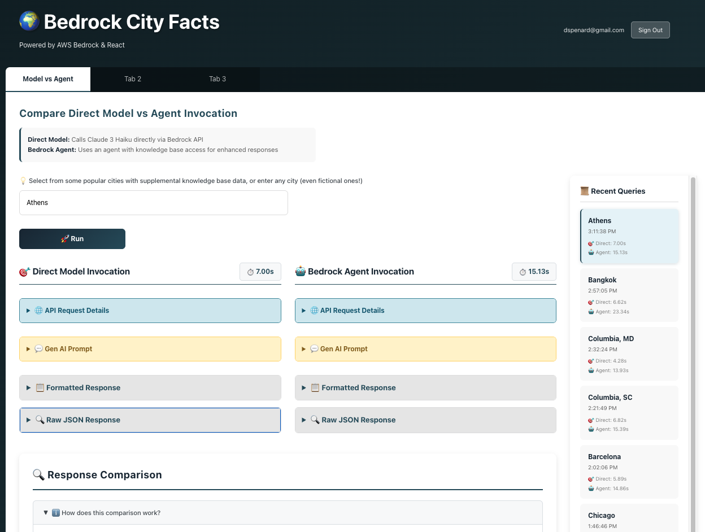

# Bedrock City Facts - Frontend

React frontend for the Bedrock City Facts application with API Gateway integration.



## Features

- **AWS Cognito Authentication**: Secure user signup and login
- **City Autocomplete**: Dropdown with 50 cities that have knowledge base data (or enter any city)
- **Single-Click Comparison**: One button calls both Lambda functions in parallel
- **API Call Details**: Shows endpoint URL and payload for each request
- **Side-by-Side Responses**: Compare Direct Model vs Agent responses simultaneously
- **Formatted Facts Display**: Clean table format with numbered facts
- **Intelligent Comparison**: Automatic detection of similar and unique facts with explanation
- **Chrome AI Analysis**: Optional AI-powered analysis using Chrome's built-in Prompt API
- **Query History**: View and reload your last 10 queries in sidebar
- **Loading Indicators**: Full-screen spinner during API calls
- **Error Handling**: User-friendly error messages

## Architecture

```
React App → API Gateway → Lambda Functions → AWS Bedrock
```

- **Direct Lambda**: Calls Claude 3 Haiku directly via Bedrock
- **Agent Lambda**: Uses Bedrock Agent with Knowledge Base access

## Getting Started

### Prerequisites

- Node.js 14+ and npm
- AWS Cognito User Pool deployed (via Terraform)
- Valid Cognito user account

### Installation

```bash
npm install
```

### Configuration

The Cognito configuration is in `src/aws-config.js`. It's automatically configured when you deploy with Terraform.

To view your Cognito settings:
```bash
../scripts/get-cognito-config.sh
```

### Creating a Test User

You can either:

1. **Sign up through the UI** (recommended for testing)
   - Run the app and click "Create Account"
   - Enter email and password
   - Verify email with the code sent to your inbox

2. **Create via AWS CLI**:
```bash
aws cognito-idp admin-create-user \
  --user-pool-id us-east-1_WAdrmTPmf \
  --username test@example.com \
  --user-attributes Name=email,Value=test@example.com Name=email_verified,Value=true \
  --temporary-password TempPass123! \
  --message-action SUPPRESS
```

### Run Development Server

```bash
npm start
```

The app will open at [http://localhost:3000](http://localhost:3000)

### Build for Production

```bash
npm run build
```

This creates an optimized production build in the `build` folder.

## API Endpoints

The app connects to these API Gateway endpoints with Cognito authentication:

- **Direct Lambda**: `POST /prod/direct`
- **Agent Lambda**: `POST /prod/agent`

Both endpoints require:
- **Authorization header**: JWT token from Cognito (automatically added by the app)
- **Request body**:
```json
{
  "city": "Tokyo"
}
```

### Authentication Flow

1. User signs in via Cognito
2. App receives JWT token
3. Token is included in `Authorization` header for all API calls
4. API Gateway validates token with Cognito
5. If valid, request is forwarded to Lambda

### Rate Limiting

API Gateway has throttling enabled to prevent abuse:
- **Rate Limit**: 25 requests per second (steady state)
- **Burst Limit**: 50 requests (short bursts allowed)
- **Error Response**: `429 Too Many Requests` if limits exceeded

These limits are sufficient for normal testing and development but protect against accidental abuse or runaway costs.

## Project Structure

```
frontend/
├── public/
│   └── index.html                      # HTML template
├── src/
│   ├── components/
│   │   ├── CityInput.js                # City autocomplete dropdown
│   │   ├── Header.js                   # App header with sign out
│   │   ├── HistorySidebar.js           # Query history sidebar
│   │   ├── LambdaTab.js                # Main comparison tab
│   │   ├── ResponseCard.js             # Individual response display
│   │   ├── ResponseComparison.js       # Side-by-side comparison
│   │   └── TabBar.js                   # Tab navigation
│   ├── App.js                          # Main App component with auth
│   ├── App.css                         # App styles
│   ├── aws-config.js                   # Cognito configuration
│   ├── index.js                        # React entry point
│   └── index.css                       # Global styles
├── package.json                        # Dependencies and scripts
├── package-lock.json                   # Locked dependency versions
└── README.md                           # This file
```

## Usage

1. **Sign in** with your Cognito credentials (or create a new account)
2. **Select or enter a city**: Choose from 50 cities with KB data in the dropdown, or type any city (even fictional!)
3. Click **"🚀 Run"** to invoke both Lambda functions in parallel
4. View the **API call details** (endpoint + payload) for each request
5. Review **side-by-side responses** with formatted facts in tables
6. Expand **"ℹ️ How does this comparison work?"** to understand the algorithm
7. Review the **automatic comparison** showing unique and similar facts
8. (Optional) Click **"✨ AI Analysis"** for Chrome AI-powered insights (if available)
9. Click **previous queries** in the history sidebar to reload results
10. Click **"Sign Out"** when done

## Chrome AI Analysis (Optional)

The app includes optional AI-powered comparison analysis using Chrome's built-in Prompt API.

### Requirements

- **Chrome 127+** (Canary, Dev, or Beta channel)
- **Prompt API enabled** via chrome://flags

### Enabling Chrome AI

1. Open Chrome Canary, Dev, or Beta (version 127+)
2. Navigate to `chrome://flags/#prompt-api-for-gemini-nano`
3. Set to **Enabled**
4. Navigate to `chrome://flags/#optimization-guide-on-device-model`
5. Set to **Enabled BypassPerfRequirement**
6. Restart Chrome
7. Open DevTools Console and run:
   ```javascript
   await window.ai.languageModel.create()
   ```
8. Wait for the model to download (first time only)

### Using AI Analysis

Once enabled, the "✨ AI Analysis" button will appear in the comparison section. Click it to get:
- Key differences between responses
- Assessment of detail and specificity
- Unique insights from the knowledge base
- Overall recommendation

If Chrome AI is not available, you'll see a notice with instructions to enable it.

## Tabs

- **Model vs Agent**: Compare direct model invocation with agent-based approach
- **Tab 2**: Placeholder for future features
- **Tab 3**: Placeholder for future features

## Key UI Elements

### City Input
- **Autocomplete dropdown** with 50 major cities that have knowledge base data
- **Free text entry** - can enter any city, even fictional ones
- **Filtered suggestions** - dropdown filters as you type
- Cities with KB data include: Tokyo, Paris, London, New York, and 46 more

### Response Display
- **Endpoint details**: Shows POST URL and JSON payload
- **Request timing**: Displays completion time for each API call
- **Formatted response**: Facts displayed in numbered table format
- **Raw JSON**: Expandable section with full response data

### Comparison Section
- **Statistics**: Shows total facts and similar count
- **How it works**: Expandable explanation of the comparison algorithm
- **Chrome AI setup**: Instructions for enabling experimental AI features
- **Categorized facts**:
  - ✨ Unique to Direct Model (blue)
  - 🎯 Unique to Agent (purple) - highlights KB data
  - 🤝 Similar Facts (green) - side-by-side comparison

### History Sidebar
- **Last 10 queries** with timestamps
- **Request times** for both API calls
- **Click to reload** any previous result
- **Active highlight** shows current selection
